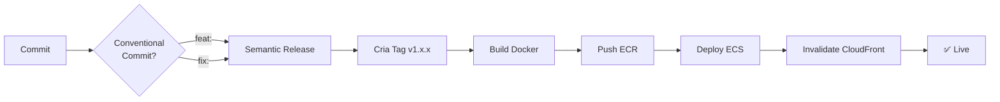

# Grupo SER - Plataforma Multi-Domínio

Plataforma web multi-institucional para o Grupo SER Educacional, suportando 6 instituições de ensino com arquitetura escalável na AWS.

---

## 🎓 Instituições

- **UNAMA** - unama.com.br
- **UNINASSAU** - uninassau.com.br
- **UNG** - ung.edu.br
- **UNINORTE** - uninorte.com.br
- **UNIFAEL** - unifael.edu.br
- **UNI7** - uni7.edu.br

---

## 🏗️ Arquitetura

### Stack

- **Frontend**: Next.js 16 (App Router, SSR + ISR)
- **CMS**: Strapi 4 (Headless CMS)
- **Database**: PostgreSQL (RDS)
- **Storage**: S3 + CloudFront CDN
- **Containers**: ECS Fargate
- **CI/CD**: GitHub Actions + Semantic Release

### Arquitetura AWS

```
┌─────────────┐
│   Route 53  │ → DNS multi-domínio
└─────┬───────┘
      │
┌─────▼───────┐
│ CloudFront  │ → CDN global + cache
└─────┬───────┘
      │
┌─────▼───────┐
│     ALB     │ → Load balancing
└─────┬───────┘
      │
┌─────▼───────┐
│ ECS Fargate │ → Next.js + Strapi
└─────┬───────┘
      │
┌─────▼───────┬──────────┐
│  RDS (PG)   │    S3    │
└─────────────┴──────────┘
```

---

## 🚀 Quick Start

### Opção 1: Deploy de Teste (AWS Free Tier)

Para testar na sua conta AWS pessoal (custo: $0-5/mês):

```bash
# 1. Clone o repositório
git clone https://github.com/seu-usuario/grupo-ser.git
cd grupo-ser

# 2. Configure AWS CLI
aws configure
# Insira suas credenciais

# 3. Execute o script de deploy
./scripts/deploy-aws-test.sh

# ⏳ Aguarde ~30-45 minutos
# ✅ URLs serão exibidas ao final
```

Veja: [docs/AWS-FREE-TIER-SETUP.md](next/docs/AWS-FREE-TIER-SETUP.md)

---

### Opção 2: Deploy Produção (Conta do Cliente)

Para deploy na conta AWS do cliente:

```bash
# 1. Provisionar infraestrutura
# Siga: next/docs/AWS-SETUP.md

# 2. Configurar GitHub Secrets
# Siga: next/docs/GITHUB-SECRETS.md

# 3. Fazer deploy via GitHub Actions
git tag v1.0.0
git push origin v1.0.0

# ✅ Deploy automático via CI/CD
```

---

## 📚 Documentação Completa

### Guias de Setup

| Documento | Descrição | Tempo |
|-----------|-----------|-------|
| [AWS-FREE-TIER-SETUP.md](next/docs/AWS-FREE-TIER-SETUP.md) | Deploy de teste (Free Tier) | 30-45min |
| [AWS-SETUP.md](next/docs/AWS-SETUP.md) | Setup completo produção | 1-2h |
| [GITHUB-SECRETS.md](next/docs/GITHUB-SECRETS.md) | Configurar secrets CI/CD | 15min |
| [DEPLOY.md](next/docs/DEPLOY.md) | Processo de deploy | - |
| [MIGRATION-BETWEEN-ACCOUNTS.md](next/docs/MIGRATION-BETWEEN-ACCOUNTS.md) | Migrar teste → produção | 1h |

### Guias Técnicos

| Documento | Descrição |
|-----------|-----------|
| [SYSTEM-DESIGN.md](next/SYSTEM-DESIGN.md) | Diagramas de arquitetura |
| [IMPLEMENTATION.md](next/IMPLEMENTATION.md) | Detalhes de implementação |
| [MIGRATION-COMPLETE.md](next/MIGRATION-COMPLETE.md) | Checklist de migração AWS |
| [WEBHOOK-SETUP.md](strapi/docs/WEBHOOK-SETUP.md) | Configurar webhooks Strapi |

---

## 🛠️ Development

### Requisitos

- Node.js 20+
- Yarn 4
- Docker
- AWS CLI

### Setup Local

```bash
# 1. Instalar dependências
cd next
yarn install

cd ../strapi
yarn install

# 2. Configurar environment
cp next/.env.example next/.env
cp strapi/.env.example strapi/.env

# Editar .env files com suas credenciais

# 3. Rodar localmente
cd next
yarn dev  # http://localhost:3000

cd ../strapi
yarn develop  # http://localhost:1337
```

---

## 🔄 CI/CD

### Workflow Automático



### Comandos

```bash
# Deploy Next.js (automático via tag)
git commit -m "feat: nova funcionalidade"
git push origin main
# → Semantic Release cria tag
# → GitHub Actions faz deploy

# Deploy Strapi (manual via tag)
git tag strapi-v1.0.0
git push origin strapi-v1.0.0
# → GitHub Actions faz deploy
```

Veja: [DEPLOY.md](next/docs/DEPLOY.md)

---

## 🧪 Testing

### Testar Deploy Local

```bash
# Build Docker local
cd next
docker build -t grupo-ser-next:test .

# Rodar container
docker run -p 3000:3000 \
  -e STRAPI_URL=http://host.docker.internal:1337 \
  grupo-ser-next:test

# Testar health check
curl http://localhost:3000/api/health-check
```

### Testar na AWS

```bash
# Health checks
curl http://ALB_DNS/api/health-check
curl http://ALB_DNS/_health

# Testar revalidation
curl -X POST http://ALB_DNS/api/revalidate \
  -H "Authorization: Bearer SECRET" \
  -d '{"path": "/cursos"}'
```

---

## 💰 Custos AWS

### Free Tier (Teste)
- **Custo**: $0-5/mês
- **Duração**: 12 meses
- **Limitações**: 1 task, db.t3.micro, sem Multi-AZ

### Produção (Cliente)
- **Custo**: ~$213/mês
- **Inclui**:
  - ECS Fargate (2-4 tasks)
  - RDS Multi-AZ (db.t3.small)
  - ALB (2x)
  - CloudFront
  - S3 (50GB)

Veja breakdown completo: [AWS-SETUP.md](next/docs/AWS-SETUP.md#-estimativa-de-custos)

---

## 🔐 Segurança

### Secrets Management

Todos os secrets são gerenciados via GitHub Secrets:

- AWS credentials (IAM user CI/CD)
- Database passwords
- Strapi secrets (JWT, API tokens)
- Revalidation token

Veja: [GITHUB-SECRETS.md](next/docs/GITHUB-SECRETS.md)

### Best Practices

- ✅ IAM roles com least privilege
- ✅ Security groups restritivos
- ✅ RDS em private subnet (produção)
- ✅ S3 com block public access
- ✅ SSL/TLS via ACM
- ✅ Secrets rotation (90 dias)

---

## 📊 Monitoramento

### CloudWatch

```bash
# Ver logs em tempo real
aws logs tail /ecs/next-frontend --follow

aws logs tail /ecs/strapi-backend --follow

# Métricas
aws cloudwatch get-metric-statistics \
  --namespace AWS/ECS \
  --metric-name CPUUtilization \
  --dimensions Name=ServiceName,Value=next-frontend-service
```

### Health Checks

- **Next.js**: `/api/health-check`
- **Strapi**: `/_health`
- **Target Groups**: Health check automático (ALB)

---

## 🚨 Troubleshooting

### Deploy Falha

```bash
# Ver logs do GitHub Actions
gh run list
gh run view <run-id> --log

# Ver logs do ECS
aws logs tail /ecs/next-frontend --follow
```

### Container Não Inicia

```bash
# Verificar task definition
aws ecs describe-task-definition --task-definition next-frontend

# Verificar service events
aws ecs describe-services \
  --cluster grupo-ser-production \
  --services next-frontend-service
```

### Database Connection Error

```bash
# Testar conectividade
psql -h RDS_ENDPOINT -U postgres -d strapi

# Verificar security group
aws ec2 describe-security-groups --group-ids sg-xxx
```

Veja: [DEPLOY.md - Troubleshooting](next/docs/DEPLOY.md#-troubleshooting)

---

## 🧹 Cleanup

### Deletar Ambiente de Teste

```bash
# Deletar todos os recursos de teste
./scripts/cleanup-aws-test.sh

# Confirmar (digite DELETE)
# ✅ Todos os recursos deletados
```

### Rollback de Deploy

```bash
# Via tag
git tag v1.0.0-rollback v1.0.0
git push origin v1.0.0-rollback

# Via ECS (manual)
aws ecs update-service \
  --cluster grupo-ser-production \
  --service next-frontend-service \
  --task-definition next-frontend:PREVIOUS_VERSION
```

---

## 🤝 Contribuindo

### Conventional Commits

```bash
# Types
feat:     Nova funcionalidade
fix:      Correção de bug
docs:     Apenas documentação
style:    Formatação
refactor: Refatoração
perf:     Performance
test:     Testes
chore:    Build/config

# Exemplos
git commit -m "feat: adiciona busca por filtros"
git commit -m "fix: corrige upload de imagens"
git commit -m "docs: atualiza README"
```

### Pull Requests

```bash
# 1. Criar branch
git checkout -b feature/nova-funcionalidade

# 2. Fazer alterações
git add .
git commit -m "feat: nova funcionalidade"

# 3. Push
git push origin feature/nova-funcionalidade

# 4. Criar PR
gh pr create --title "feat: nova funcionalidade"
```

---

## 📞 Suporte

### Documentação

- [AWS Documentation](https://docs.aws.amazon.com/)
- [Next.js Docs](https://nextjs.org/docs)
- [Strapi Docs](https://docs.strapi.io/)

### Contato

- GitHub Issues: [grupo-ser/issues](https://github.com/seu-usuario/grupo-ser/issues)
- Email: suporte@gruposer.com.br

---

## 📝 Licença

Propriedade do Grupo SER Educacional.

---

## ✅ Status do Projeto

| Componente | Status | Versão |
|------------|--------|--------|
| Next.js Frontend | ✅ Pronto | v1.0.0 |
| Strapi CMS | ✅ Pronto | v1.0.0 |
| Docker Build | ✅ Pronto | - |
| GitHub Actions | ✅ Pronto | - |
| Documentação | ✅ Completa | - |
| AWS Infra (Teste) | ⏳ Pendente | - |
| AWS Infra (Prod) | ⏳ Pendente | - |

**Próximo passo**: Deploy de teste na sua conta AWS

---

**Última atualização**: 2024-12-18
