# System Design - Grupo SER Multi-Domínio na AWS

## Visão Geral

Sistema multi-domínio para instituições educacionais do Grupo SER, hospedado na AWS com arquitetura escalável, altamente disponível e otimizada para performance global.

### Instituições Suportadas
- UNAMA (unama.com.br)
- UNINASSAU (uninassau.com.br)
- UNG (ung.edu.br)
- UNINORTE (uninorte.com.br)
- UNIFAEL (unifael.edu.br)
- UNI7 (uni7.edu.br)

---

## Arquitetura de Alto Nível

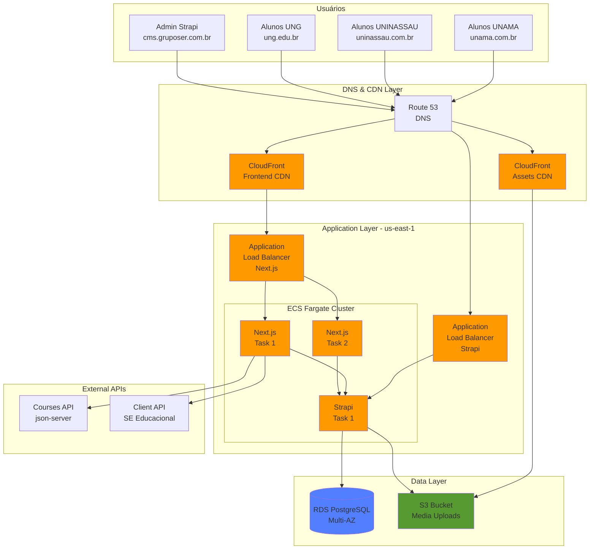

---

## Fluxo de Request - Frontend

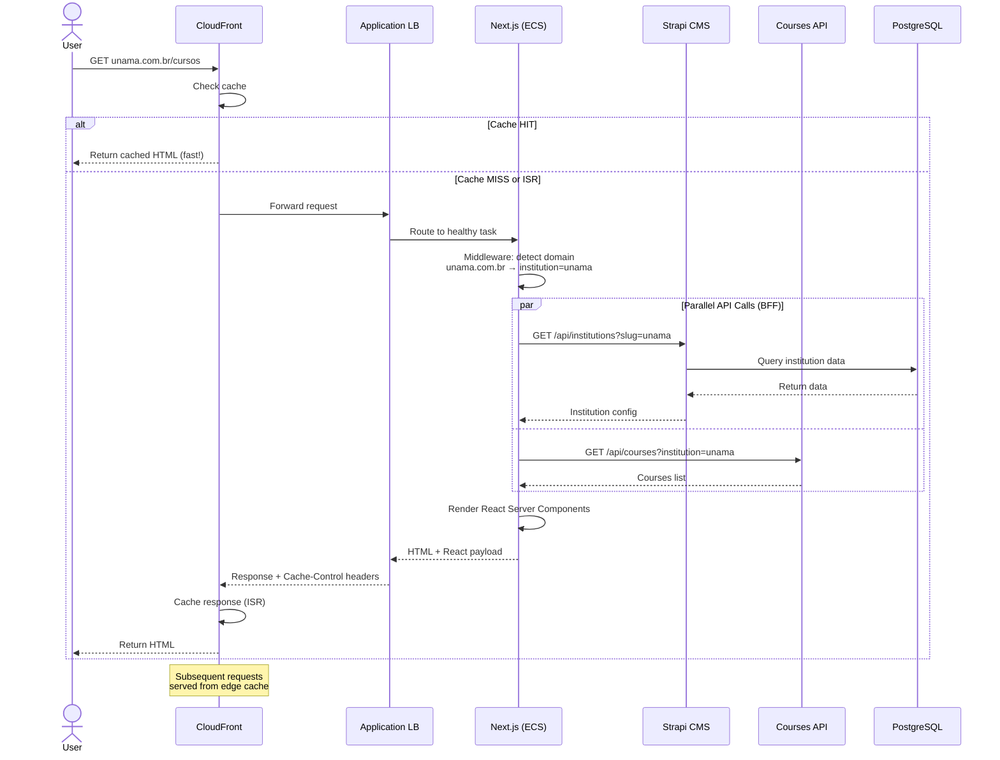

---

## Fluxo de Revalidação (ISR)

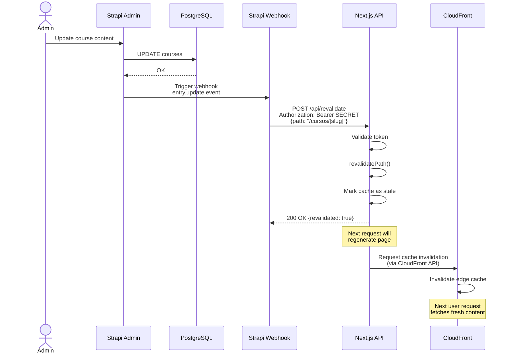

---

## Arquitetura de Rede (VPC)

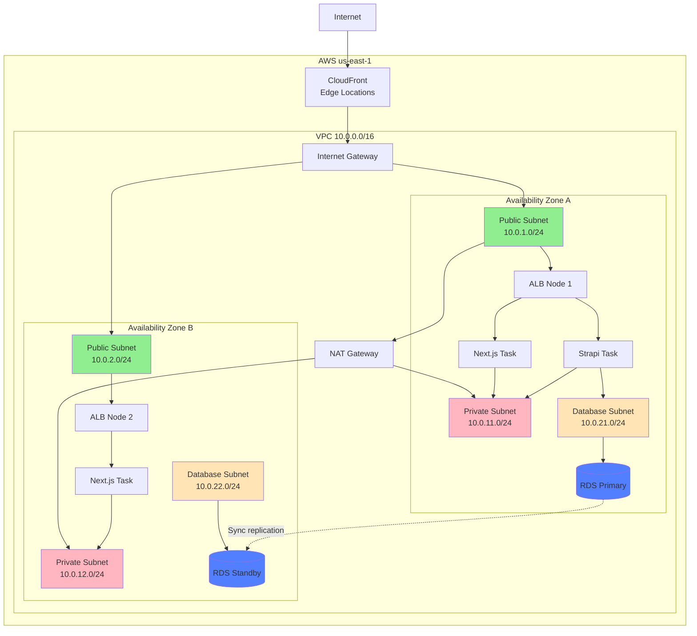

---

## Multi-Domínio: Middleware Flow

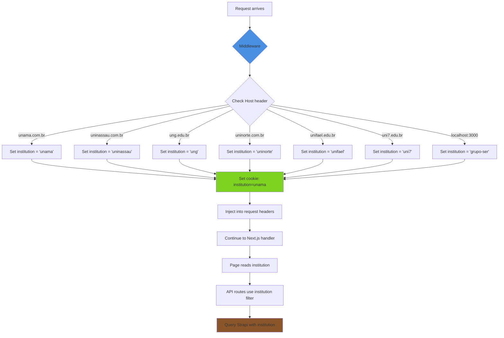

---

## CI/CD Pipeline

```mermaid
flowchart LR
    subgraph "Developer Workflow"
        DEV[Developer]
        COMMIT[git commit -m 'feat: ...']
        PUSH[git push origin main]
    end

    subgraph "GitHub Actions"
        TRIGGER[Workflow triggered]
        SR[Semantic Release]
        TAG[Create tag v1.2.3]
    end

    subgraph "Build & Deploy - Next.js"
        BUILD_NEXT[Docker build Next.js]
        ECR_NEXT[Push to ECR<br/>grupo-ser/next:1.2.3]
        TASK_NEXT[Update ECS Task Definition]
        DEPLOY_NEXT[Deploy to ECS Fargate]
        INVALIDATE[Invalidate CloudFront cache]
    end

    subgraph "Build & Deploy - Strapi"
        BUILD_STRAPI[Docker build Strapi]
        ECR_STRAPI[Push to ECR<br/>grupo-ser/strapi:1.2.3]
        TASK_STRAPI[Update ECS Task Definition]
        DEPLOY_STRAPI[Deploy to ECS Fargate]
        MIGRATE[Wait for DB migrations]
    end

    subgraph "Monitoring"
        HEALTH[Health checks]
        ALERT[CloudWatch alarms]
        NOTIFY[Slack/Email notification]
    end

    DEV --> COMMIT
    COMMIT --> PUSH
    PUSH --> TRIGGER

    TRIGGER --> SR
    SR --> TAG

    TAG -->|v*| BUILD_NEXT
    TAG -->|strapi-v*| BUILD_STRAPI

    BUILD_NEXT --> ECR_NEXT
    ECR_NEXT --> TASK_NEXT
    TASK_NEXT --> DEPLOY_NEXT
    DEPLOY_NEXT --> INVALIDATE

    BUILD_STRAPI --> ECR_STRAPI
    ECR_STRAPI --> TASK_STRAPI
    TASK_STRAPI --> DEPLOY_STRAPI
    DEPLOY_STRAPI --> MIGRATE

    INVALIDATE --> HEALTH
    MIGRATE --> HEALTH
    HEALTH --> ALERT
    ALERT --> NOTIFY

    style SR fill:#FF6B6B
    style TAG fill:#4ECDC4
    style DEPLOY_NEXT fill:#95E1D3
    style DEPLOY_STRAPI fill:#95E1D3
    style NOTIFY fill:#F38181
```

---

## Estratégia de Cache Multi-Layer

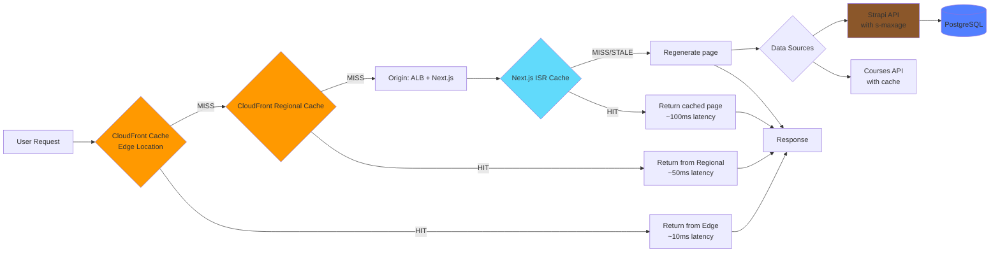

### TTLs por Tipo de Conteúdo

| Tipo | CloudFront | Next.js ISR | Strapi API |
|------|-----------|------------|------------|
| Páginas dinâmicas | 5 min | On-demand revalidate | 5 min |
| Assets estáticos (_next/static) | 1 ano | N/A | N/A |
| Imagens (uploads) | 1 ano | N/A | N/A |
| API routes | No cache | N/A | Vary by endpoint |
| Curriculum/FAQ | 1 hora | On-demand | 1 hora |

---

## Segurança

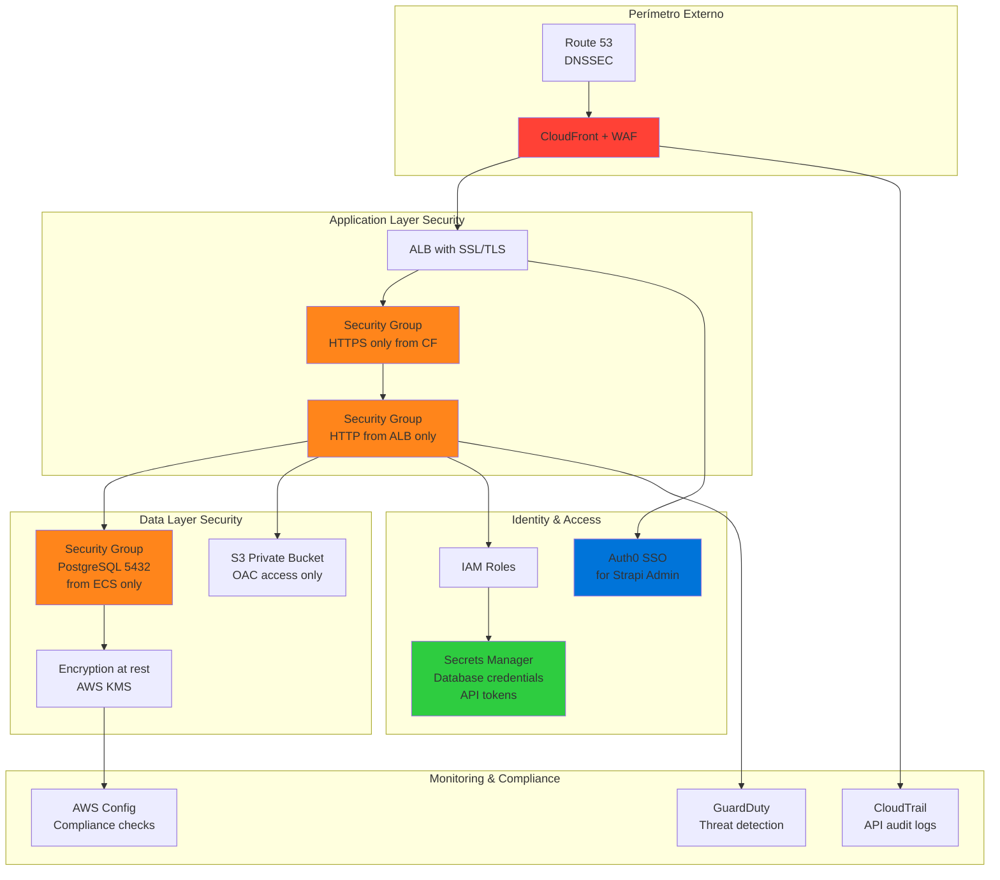

### Checklist de Segurança

#### Rede
- ✅ VPC com subnets públicas e privadas
- ✅ NAT Gateway para saída privada
- ✅ Security Groups com princípio do menor privilégio
- ✅ NACLs para controle adicional
- ✅ VPC Flow Logs habilitados

#### Aplicação
- ✅ WAF na CloudFront (proteção DDoS, SQL injection, XSS)
- ✅ Rate limiting por IP
- ✅ SSL/TLS em todas as comunicações
- ✅ Headers de segurança (HSTS, CSP, X-Frame-Options)
- ✅ Validação de input em API routes

#### Dados
- ✅ RDS com encryption at rest (KMS)
- ✅ RDS com encryption in transit (SSL)
- ✅ Backups automáticos (7 dias retenção)
- ✅ S3 com encryption (AES-256)
- ✅ S3 com versionamento
- ✅ S3 bucket privado (acesso via OAC)

#### Identidade
- ✅ IAM roles com permissões mínimas
- ✅ Secrets Manager para credenciais
- ✅ Rotação automática de secrets
- ✅ MFA para acesso ao admin
- ✅ SSO via Auth0/Okta

#### Monitoramento
- ✅ CloudTrail para auditoria
- ✅ GuardDuty para detecção de ameaças
- ✅ AWS Config para compliance
- ✅ CloudWatch Logs centralizados
- ✅ Alertas para atividades suspeitas

---

## Disaster Recovery

### RTO & RPO

| Cenário | RTO (Recovery Time) | RPO (Data Loss) |
|---------|---------------------|-----------------|
| ECS task failure | < 2 min | 0 (stateless) |
| Availability Zone failure | < 5 min | 0 |
| Region failure | < 4 hours | < 5 min |
| Data corruption | < 1 hour | < 15 min |

### Estratégia de Backup

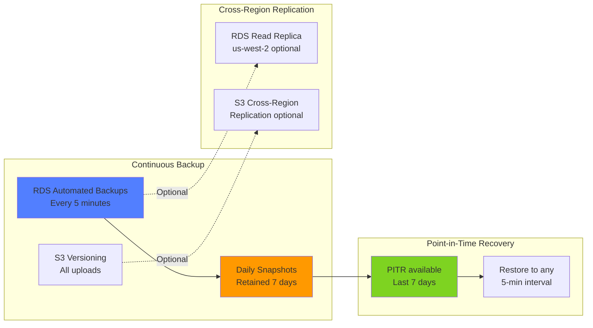

### Plano de Rollback

1. **Code Rollback**: Deploy tag anterior via GitHub Actions
2. **Database Rollback**: Restore snapshot RDS (último 5 min)
3. **DNS Rollback**: Alterar CNAME no Route 53 (TTL 300s = 5 min)
4. **Cache Rollback**: Invalidate CloudFront para forçar novo fetch

---

## Observabilidade

### Dashboard CloudWatch

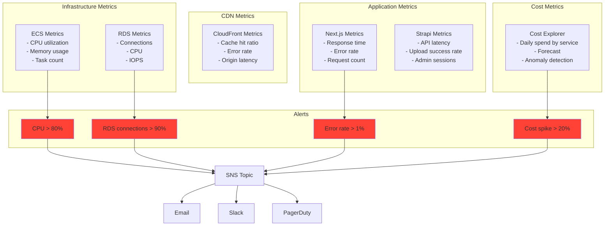

### Logs Centralizados

```
CloudWatch Log Groups:
├── /ecs/next-frontend
│   ├── [timestamp] INFO: Request to /cursos duration=120ms
│   ├── [timestamp] ERROR: Strapi API timeout
│   └── [timestamp] WARN: Cache miss ratio high
├── /ecs/strapi-backend
│   ├── [timestamp] INFO: Upload to S3 success
│   ├── [timestamp] ERROR: Database connection pool exhausted
│   └── [timestamp] INFO: Webhook triggered revalidation
├── /aws/lambda/edge (se usar Lambda@Edge)
├── /aws/rds/postgresql
└── /aws/cloudfront/access-logs
```

---

## Escalabilidade

### Auto Scaling Triggers

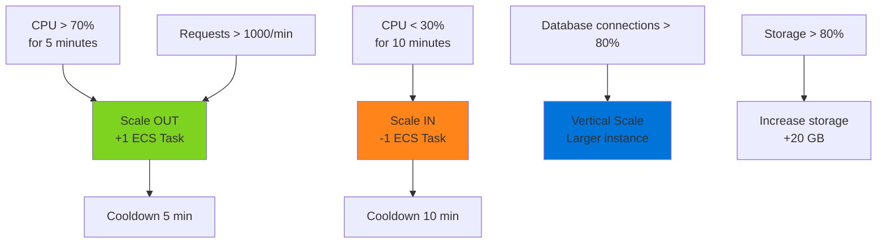

### Capacity Planning

| Componente | Atual | 10x Traffic | 100x Traffic |
|-----------|-------|-------------|--------------|
| **Next.js Tasks** | 2 | 5 | 20 |
| **Strapi Tasks** | 1 | 2 | 5 |
| **RDS Instance** | db.t4g.small | db.r6g.large | db.r6g.2xlarge |
| **CloudFront** | Auto-scale | Auto-scale | Auto-scale |
| **S3** | Unlimited | Unlimited | Unlimited |
| **Custo Mensal** | ~$190 | ~$500 | ~$2,000 |

---

## Performance Benchmarks (Esperado)

### Latência por Região

| Localização | CloudFront Edge | Sem CDN (direto ECS) |
|-------------|-----------------|----------------------|
| São Paulo | 20-50ms | 150-250ms |
| Rio de Janeiro | 25-60ms | 180-280ms |
| Nordeste | 40-80ms | 200-350ms |
| Sul | 30-70ms | 180-300ms |
| Internacional | 100-300ms | 500-1000ms |

### Throughput

- **Next.js (2 tasks)**: ~500 req/s
- **Strapi (1 task)**: ~200 req/s
- **RDS (db.t4g.small)**: ~1000 connections, ~5000 queries/s
- **CloudFront**: Unlimited (distributed)

### Core Web Vitals (Objetivo)

| Métrica | Objetivo | Atual (Vercel) |
|---------|----------|----------------|
| **LCP** (Largest Contentful Paint) | < 2.5s | ~3.0s |
| **FID** (First Input Delay) | < 100ms | ~80ms |
| **CLS** (Cumulative Layout Shift) | < 0.1 | ~0.05 |
| **TTFB** (Time to First Byte) | < 600ms | ~800ms |

**Melhorias esperadas:**
- LCP: -30% (CloudFront edge cache mais próximo)
- TTFB: -50% (ISR + cache agressivo)

---

## Custos Detalhados (us-east-1)

### Breakdown Mensal - Tráfego Médio

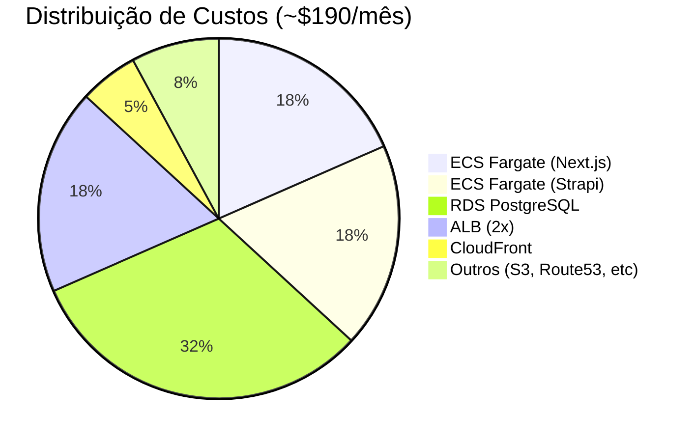

### Calculadora de Custos por Tráfego

| Tráfego Diário | Usuários Ativos | Custo Mensal | Custo por Usuário |
|----------------|-----------------|--------------|-------------------|
| 10k requests | ~3k | $190 | $0.063 |
| 100k requests | ~30k | $280 | $0.009 |
| 1M requests | ~300k | $650 | $0.002 |
| 10M requests | ~3M | $2,500 | $0.0008 |

### Comparação com Vercel

| Cenário | AWS (este design) | Vercel Pro | Vercel Enterprise |
|---------|-------------------|------------|-------------------|
| **100k req/dia** | $190/mês | $20/mês (insuficiente) | $400/mês |
| **1M req/dia** | $280/mês | Impossível (limites) | $1,200/mês |
| **10M req/dia** | $650/mês | Impossível | $5,000/mês |

**Ponto de Break-Even:** ~500k requests/dia (AWS fica mais barato)

---

## Roadmap de Implementação

### Fase 1: Preparação (Semana 1)
- [ ] Provisionar VPC e subnets
- [ ] Criar RDS PostgreSQL Multi-AZ
- [ ] Configurar S3 buckets
- [ ] Criar ECR repositories
- [ ] Configurar Secrets Manager

### Fase 2: Strapi Migration (Semana 2)
- [ ] Instalar plugin S3 no Strapi
- [ ] Configurar database para RDS
- [ ] Build Dockerfile Strapi
- [ ] Deploy ECS Fargate (Strapi)
- [ ] Migrar dados do Strapi Cloud para RDS
- [ ] Testar upload de imagens para S3

### Fase 3: Next.js Migration (Semana 3)
- [ ] Implementar middleware multi-domínio
- [ ] Configurar imagens para CDN direto
- [ ] Adicionar endpoint de revalidação
- [ ] Build Dockerfile Next.js
- [ ] Deploy ECS Fargate (Next.js)
- [ ] Configurar ALB e health checks

### Fase 4: CDN & DNS (Semana 4)
- [ ] Criar CloudFront distributions (frontend + assets)
- [ ] Configurar ACM certificates
- [ ] Configurar Route 53 ou DNS externo
- [ ] Testar multi-domínio em staging
- [ ] Migrar DNS para produção (gradual)

### Fase 5: CI/CD & Monitoring (Semana 5)
- [ ] Configurar GitHub Actions workflows
- [ ] Implementar Semantic Release
- [ ] Criar CloudWatch dashboards
- [ ] Configurar alarmes e notificações
- [ ] Documentar runbooks

### Fase 6: Otimização (Semana 6)
- [ ] Fine-tuning de cache policies
- [ ] Ajustar auto-scaling thresholds
- [ ] Implementar cost optimization
- [ ] Load testing e ajustes de performance
- [ ] Treinamento do time

---

## Contatos e Suporte

### Runbooks Críticos

**1. Scale up manual:**
```bash
aws ecs update-service \
  --cluster grupo-ser-production \
  --service next-frontend-service \
  --desired-count 4
```

**2. Invalidar cache CloudFront:**
```bash
aws cloudfront create-invalidation \
  --distribution-id E123456789 \
  --paths "/*"
```

**3. Rollback para versão anterior:**
```bash
# Via GitHub
git tag -d v1.2.3
git push origin :refs/tags/v1.2.3
git push origin v1.2.2  # Trigger redeploy
```

**4. Restaurar banco de dados:**
```bash
aws rds restore-db-instance-to-point-in-time \
  --source-db-instance-identifier grupo-ser-prod \
  --target-db-instance-identifier grupo-ser-prod-restored \
  --restore-time 2024-01-15T10:30:00Z
```

---

## Anexos

### Stack Tecnológico Completo

```
Frontend:
├── Next.js 15 (App Router)
├── React 18
├── TypeScript 5
└── Sass

Backend:
├── Strapi 4
├── Node.js 20
└── PostgreSQL 15

Infraestrutura:
├── AWS ECS Fargate
├── AWS RDS (PostgreSQL Multi-AZ)
├── AWS S3
├── AWS CloudFront
├── AWS Application Load Balancer
├── AWS Route 53
├── AWS Secrets Manager
├── AWS CloudWatch

CI/CD:
├── GitHub Actions
├── Semantic Release
├── Docker
└── AWS ECR

Observabilidade:
├── CloudWatch Logs
├── CloudWatch Metrics
├── CloudWatch Alarms
└── AWS X-Ray (opcional)

Segurança:
├── AWS WAF
├── AWS GuardDuty
├── AWS Config
├── AWS CloudTrail
└── Auth0 SSO
```

---

## Glossário

- **ISR**: Incremental Static Regeneration - páginas estáticas regeneradas on-demand
- **BFF**: Backend-for-Frontend - camada intermediária de API
- **OAC**: Origin Access Control - acesso controlado S3 → CloudFront
- **Multi-AZ**: Multi Availability Zone - alta disponibilidade
- **PITR**: Point-in-Time Recovery - restore para qualquer momento
- **RTO**: Recovery Time Objective - tempo máximo de indisponibilidade
- **RPO**: Recovery Point Objective - perda máxima de dados aceitável
- **TTL**: Time-to-Live - tempo de cache

---

**Documento gerado para:** Grupo SER
**Data:** Dezembro 2024
**Versão:** 1.0
**Autor:** System Design Team

---

## Aprovações Necessárias

- [ ] CTO - Arquitetura técnica
- [ ] CFO - Orçamento e custos
- [ ] Head de Infraestrutura - Recursos AWS
- [ ] Head de Desenvolvimento - Timeline de implementação
- [ ] Jurídico - Compliance e LGPD
- [ ] Marketing - Estratégia multi-domínio
